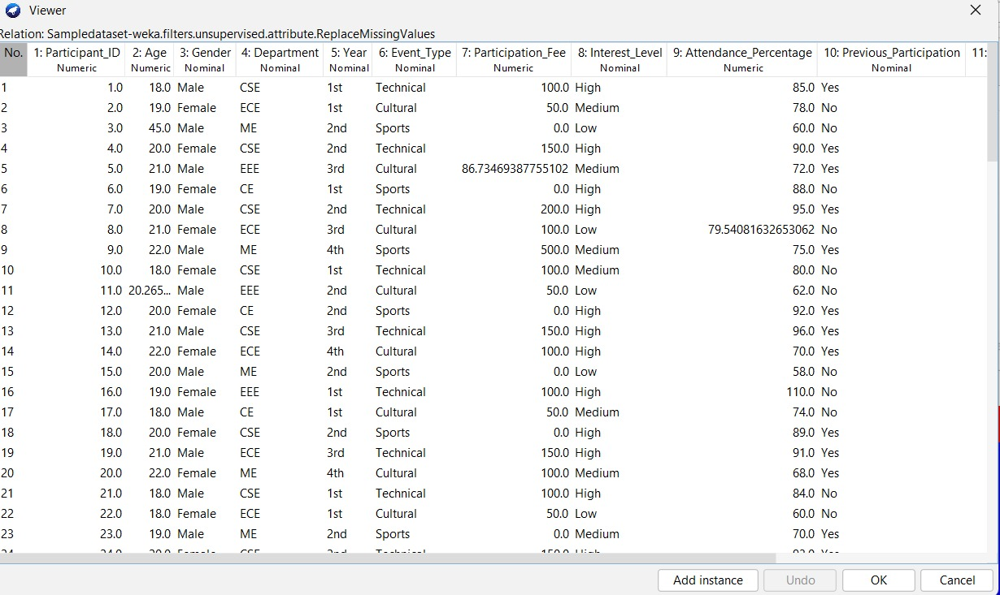
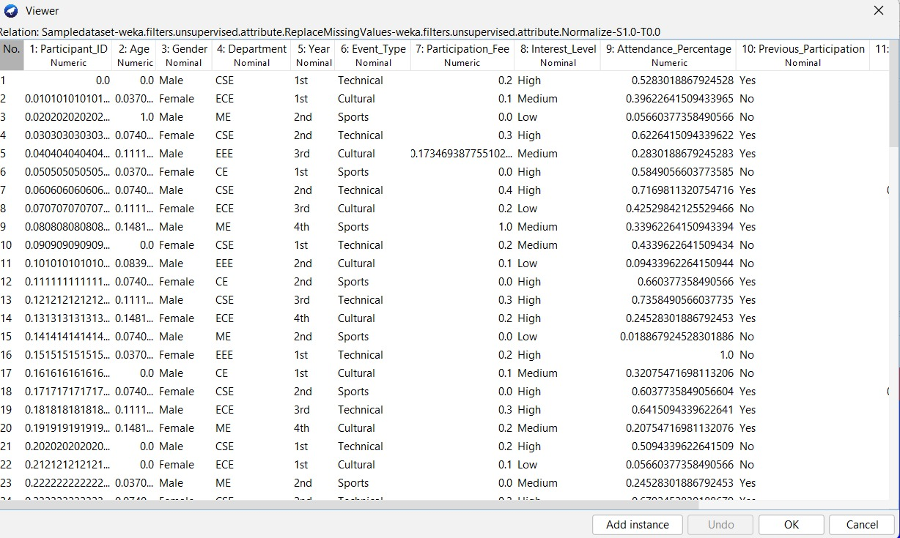
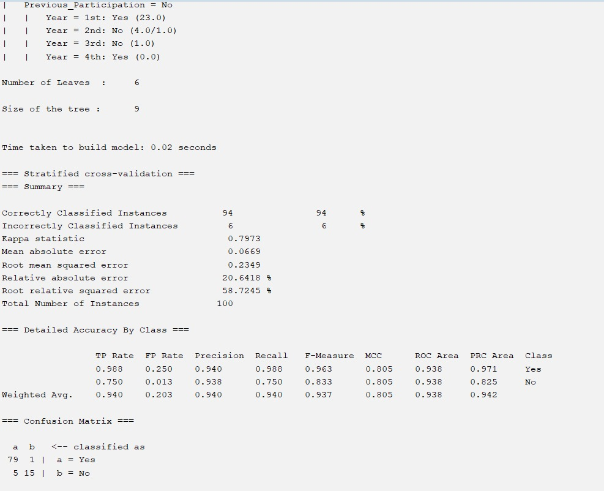
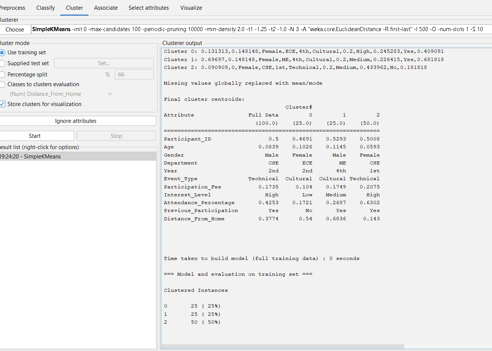
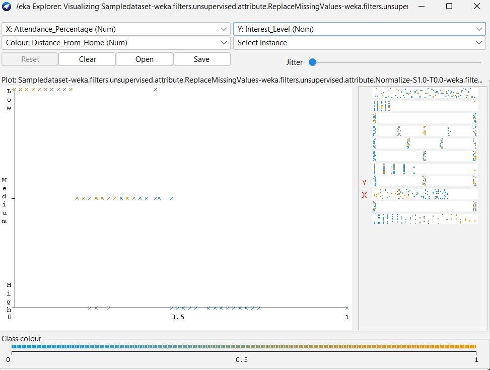

# Event Participation Analysis

## Description
This project analyzes student participation in college events using data mining techniques.

## Modules
- Data Collection
- Data Preprocessing (Mean Method & Normalization)
- Classification (J48 Algorithm)
- Clustering (K-Means Algorithm)
- Data Visualization

## Results
- Classification Accuracy: 94%
- Students grouped into 3 clusters:
  - Highly active participants
  - Occasional participants
  - Less interested students

## Dataset
The dataset contains student event participation details with some missing values.
It is used as the input for further preprocessing and analysis.

## MeanMethod(Preprocessing)
Missing numerical values are replaced with average values.
The dataset becomes complete and ready for processing.

## Normalization
Data values are scaled to a common range (0 to 1).
This helps in improving the accuracy of algorithms.

## Classification (J48 Algorithm)
Classification is used to predict student participation (Yes/No).
The model achieved 94% accuracy, showing good performance.

## Clustering (K-Means)
Students are grouped into 3 clusters based on participation behavior:
Highly active participants
Occasional participants
Less interested students

## Data_Visualization
Visualization shows the relationship between attendance and interest level.
It helps to understand patterns in student participation.

